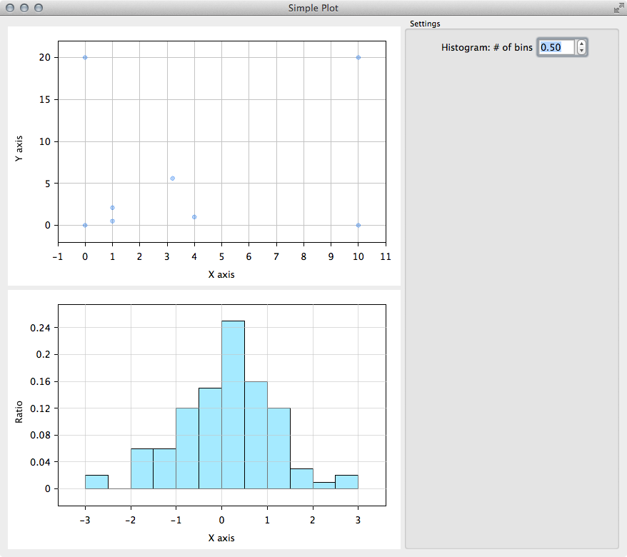

QtSimplePlot
============

QtSimplePlot is a library for simple plotting. Currently, this library
supports a scatter plot and a histogram. If you need more powerful
plotting library, please consider to use [QCustomPlot] or buy [Qt Charts].

[QCustomPlot]: http://www.qcustomplot.com
[Qt Charts]: http://doc.qt.digia.com/QtCharts/index.html

Screenshot
----------

How to use?
-----------

Please refer `QtSimplePlot.pro` to learn how to use.

License
-------

    QtSimplePlot a library for simple plotting
    Copyright (C) 2014 Yasunobu OKAMURA

    This program is free software: you can redistribute it and/or modify
    it under the terms of the GNU General Public License as published by
    the Free Software Foundation, either version 3 of the License, or
    (at your option) any later version.

    This program is distributed in the hope that it will be useful,
    but WITHOUT ANY WARRANTY; without even the implied warranty of
    MERCHANTABILITY or FITNESS FOR A PARTICULAR PURPOSE.  See the
    GNU General Public License for more details.

    You should have received a copy of the GNU General Public License
    along with this program.  If not, see <http://www.gnu.org/licenses/>.
